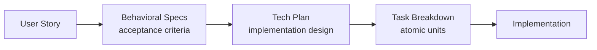

# User Stories

User stories in this project are narrative descriptions from the perspective of
**Ana** — a live commerce entrepreneur who needs fast, secure, and integrated
payment processing to grow her clothing business ([CONTEXT.md](../../CONTEXT.md)).
They sit at the top of the SDD "Full" track: stories capture *what* the user
needs and *why*, before refinement into behavioral specs.

## Naming Convention

Each story is a single markdown file with frontmatter:

```
us-NNN-descriptive-slug.md
```

- `us-001-transaction-processing.md`
- `us-002-scalability.md`
- `us-003-transaction-security.md`
- `us-004-live-conversational-integration.md`

Frontmatter includes `id`, `status` (active / superseded), and `links` back to
the specs and tasks derived from the story.

## The Four User Stories

### us-001 — Fast Transaction Processing

Ana's customers abandon carts when checkout lags during live streams. This story
demands credit and debit transactions that complete in **under 1 second** with
immediate success/failure confirmation. It drives the core fast-path in the
reactive pipeline.

### us-002 — Automatic Scalability

Live commerce events produce sudden, intense transaction surges (flash sales,
streamer peaks). Ana cannot have performance degrade mid-stream. This story
requires the system to **scale up and down automatically** based on load
thresholds, without manual capacity planning.

### us-003 — Secure Transactions

Ana needs her customers to trust the platform. This story mandates
**end-to-end secure connections** (TLS 1.3) and **secure authentication**
(3DS 2.x step-up) on every transaction, enforced before completion.

### us-004 — Live and Conversational Commerce Integration

Ana's customers transact inside live streams and chat interfaces. This story
requires an API layer that supports **in-platform payment completion** — no
redirects, no app switching. It drives the public API contract used by partner
integration teams.

## Flow: Story → Spec

User stories are not implementation artifacts. They are refined into
behavioral specifications (specs) with concrete acceptance criteria in
Given-When-Then format. Each story links to one or more specs that define
exactly what must be built and tested.



## How to Use This Folder

| Entry point | Audience | Purpose |
|---|---|---|
| [`index.md`](index.md) | AI agents, quick lookup | Flat list of all stories with one-line descriptions |
| Individual `us-NNN-*.md` files | Engineers, reviewers | Full narrative with BDD criteria and Definition of Done |
| [`../specs/README.md`](../specs/README.md) | Engineers, reviewers | Refined behavioral specs derived from these stories |
| [`../README.md`](../README.md) | Everyone | SDD folder structure and workflow overview |

## Relationship to Other Spec Artifacts

- **Specs** (`../specs/`) — each story maps to a behavioral spec that expands
  the narrative into precise, testable acceptance criteria.
- **Tech Plans** (`../tech-plans/`) — a spec may require one or more tech plans
  describing the concrete implementation approach.
- **Tasks** (`../tasks/`) — tech plans decompose into executable tasks per
  feature branch, with verification criteria.
- **ADRs** (`../adrs/`) — architectural decisions recorded during
  implementation — the "why" behind technical choices visible in the code.

## Maintenance

- Stories are updated only when user needs change, not when implementation
  details shift.
- When a story is superseded, its status becomes `superseded` and the
  frontmatter links to the replacement story.
- Specs are the source of truth for behavior; if a spec contradicts a story,
  the spec wins. Flag the inconsistency to the Spec Architect for resolution.
